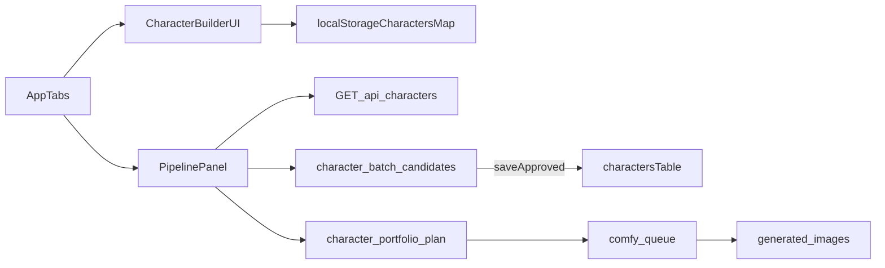

# Casting Room Plan (Discovery + Design)

Scope: discovery-only design document for Character Builder + Casting Room.

Constraint check: no source/test/config changes; this document is the only deliverable.

---

## Status update (current)

The original document below was a discovery snapshot. Since then, parts of the phase plan have shipped. Updates as of the current code state:

- **Phase 1 — DONE.** Tab labels in `src/App.jsx` are now `"Character Builder"` and `"Casting Room"` (`src/App.jsx:715–724`). The `CastingPipelinePanel` component and `'pipeline'` tab key are still used internally to keep route/state names stable.
- **Phase 2 — substantially DONE for slug/token surface.** A reusable utility now exists at `src/utils/slugify.js` (`toSnakeSlug`, `withUniqueSuffix`, `resolveCharacterSlug`). `CharacterBuilder.jsx` writes snake_case slugs with auto-suffix collision handling and a duplicate guard. `assembler.js` resolves both snake_case and kebab-case `@token` references for backward compatibility (`src/utils/assembler.js:51–58`). The "explicit character bank contract" piece is still local-storage backed.
- **Phase 3 — OPEN.** Character Builder still persists to `localStorage` (`qpb_characters_v1`); no DB-backed `/api/character` create/read endpoint added yet.
- **Phase 4–6 — OPEN** as originally described.

Open question status (compared to §I below):

- Q3 (tag format) — resolved as snake_case (`@lena_sholk`).
- Q5 (rename scope) — resolved as Option A (UI text only; internal API/component identifiers unchanged).
- Other questions remain open.

The factual sections below (A.3, F.4, G) were correct at the time of discovery; later corrections appear inline as **[Updated]** notes so the original evidence anchors are preserved.

---

## A) Existing tab structure

### A.1 Current tab implementation location

- The app-level tabs are implemented directly in `src/App.jsx` via local `activeTab` state, not a router-based tab system (`src/App.jsx:L170`, `src/App.jsx:L707-L726`).
- A router setup (`BrowserRouter`, `Routes`, `Route`, `useRoutes`) is **NOT FOUND in repo** under `src` (search result: no matches).

### A.2 Current tab labels (exact JSX/string values)

- Tab button label `"Prompt Builder"` is rendered in `src/App.jsx` (`src/App.jsx:L712`).
- Tab button label `"Characters"` is rendered in `src/App.jsx` (`src/App.jsx:L718`).
- Tab button label `"Pipeline"` is rendered in `src/App.jsx` (`src/App.jsx:L724`).
- The third tab renders `<CastingPipelinePanel />` when `activeTab === 'pipeline'` (`src/App.jsx:L721-L723`, `src/App.jsx:L894-L896`).

### A.3 Current status of requested naming

- A tab label `"Character Builder"` is currently **absent** at tab-button level; the tab label is `"Characters"` (`src/App.jsx:L715-L719`).
- The string `"Character Builder"` exists as an internal section heading `<h2>Character Builder</h2>` inside the tab content component (`src/components/CharacterBuilder.jsx:L100`).
- A tab label `"Casting Room"` is currently **absent**; current tab label is `"Pipeline"` (`src/App.jsx:L724`).
- Inside the panel, heading is also `"Pipeline"` (`src/components/CastingPipelinePanel.jsx:L431`).

**[Updated]** Tab labels are now `"Character Builder"` and `"Casting Room"` in `src/App.jsx:718` and `src/App.jsx:724`. The `CastingPipelinePanel` component and the `'pipeline'` tab state key are unchanged.

---

## B) Existing character data model

### B.1 SQLite schema for characters

`characters` table definition:

- `id TEXT PRIMARY KEY` (`api/lib/db/schema.js:L2-L4`).
- `project_id TEXT` (`api/lib/db/schema.js:L4`).
- `embedding_status TEXT NOT NULL DEFAULT 'not_indexed'` (`api/lib/db/schema.js:L5`).
- `payload_json TEXT NOT NULL` (`api/lib/db/schema.js:L6`).
- `created_at TEXT NOT NULL` (`api/lib/db/schema.js:L7`).
- `updated_at TEXT NOT NULL` (`api/lib/db/schema.js:L8`).

Indexes:

- `idx_characters_project_id` on `project_id` (`api/lib/db/schema.js:L11`).
- `idx_characters_created_at` on `created_at` (`api/lib/db/schema.js:L12`).

Slug/tag/handle columns in `characters` table:

- `slug` column: **NOT FOUND in repo** in schema.
- `handle` column: **NOT FOUND in repo** in schema.
- `tag` column: **NOT FOUND in repo** in schema.

### B.2 Character payload shape enforced in repository layer

`createCharacter()` validates payload via `parseCharacterProfile()` before persistence (`api/lib/db/repositories.js:L29-L36`, `api/lib/db/repositories.js:L17-L19`).

Character payload schema (stored inside `payload_json`) includes structured fields like:

- Identity/meta: `id`, optional `projectId`, optional `name` (`api/lib/characters/schemas.js:L23-L27`).
- Core appearance fields (`faceShape`, `eyes`, `eyebrows`, `nose`, `lips`, `jawline`, etc.) (`api/lib/characters/schemas.js:L31-L46`).
- `distinctiveFeatures` array and `visualKeywords` array (`api/lib/characters/schemas.js:L47`, `api/lib/characters/schemas.js:L51`).
- Optional prompt seed and embedding status (`api/lib/characters/schemas.js:L53-L55`).
- Required `createdAt`, `updatedAt` (`api/lib/characters/schemas.js:L55-L56`).

No dedicated free-text `description` field in this schema:

- `description` key is **NOT FOUND in repo** in `CharacterProfileSchema` (`api/lib/characters/schemas.js:L23-L58`).

### B.3 In-memory shape returned by `listCharacters()`

- `listCharacters()` selects `payload_json` from `characters` and returns `rows.map(rowToPayload)` (`api/lib/db/repositories.js:L99-L107`).
- `rowToPayload()` returns `JSON.parse(row.payload_json)` (`api/lib/db/repositories.js:L12-L15`).
- Therefore, in-memory shape is the full character payload object stored in `payload_json`, expected to conform to `CharacterProfileSchema` (`api/lib/db/repositories.js:L17-L19`, `api/lib/characters/schemas.js:L23-L58`).

### B.4 Character read endpoints

- Frontend-visible list endpoint exists at `GET /api/characters`, returning `{ ok: true, items }` (`vite.config.js:L196-L209`).
- A single-character read endpoint like `GET /api/character?id=...` is **NOT FOUND in repo** in `vite.config.js`.
- Internal non-HTTP read helper `getCharacter(db, id)` exists in repository layer (`api/lib/db/repositories.js:L51-L54`).

---

## C) Existing character endpoints (frontend-visible)

All `/api/characters*` and `/api/character-*` routes registered in `vite.config.js`:

1. `POST /api/characters-generate-batch` — generate a candidate batch from generation request; optionally persist batch (`vite.config.js:L118-L174`).
2. `GET /api/character-batches` — list character batches by optional status (`vite.config.js:L176-L194`).
3. `GET /api/characters` — list persisted characters (optional `projectId`) (`vite.config.js:L196-L215`).
4. `GET /api/character-batch` — get one batch by `id` (`vite.config.js:L217-L244`).
5. `GET /api/character-batch-candidates` — list candidates for `batchId`, optional filters (`vite.config.js:L246-L273`).
6. `POST /api/character-batch-candidate-approve` — approve candidate (`vite.config.js:L275-L297`).
7. `POST /api/character-batch-candidate-reject` — reject candidate (`vite.config.js:L299-L321`).
8. `POST /api/character-batch-candidate-save` — save approved candidate as character (`vite.config.js:L323-L345`).
9. `POST /api/character-batch-candidate-mutate` — mutate candidate and create new candidate round (`vite.config.js:L347-L391`).
10. `POST /api/character-batch-refill` — refill batch to target usable count (`vite.config.js:L393-L437`).
11. `POST /api/character-portfolio-plan` — create reusable/created view plan for character prompt packs (`vite.config.js:L500-L524`).
12. `POST /api/character-portfolio-queue` — queue character portfolio generation through Comfy (`vite.config.js:L526-L553`).

### C.1 Which routes are currently called from frontend

Called from frontend API layer:

- `/api/character-batches` (`src/lib/api/characterBatches.js:L4`).
- `/api/characters` (`src/lib/api/characterBatches.js:L8`).
- `/api/character-batch` (`src/lib/api/characterBatches.js:L12`).
- `/api/character-batch-candidates` (`src/lib/api/characterBatches.js:L16`).
- `/api/character-batch-candidate-approve` (`src/lib/api/characterBatches.js:L20`).
- `/api/character-batch-candidate-reject` (`src/lib/api/characterBatches.js:L24`).
- `/api/character-batch-candidate-save` (`src/lib/api/characterBatches.js:L28`).
- `/api/character-portfolio-plan` (`src/lib/api/portfolio.js:L4`).
- `/api/character-portfolio-queue` (`src/lib/api/portfolio.js:L8`).

UI usage evidence (panel):

- API functions imported and used in `CastingPipelinePanel` (`src/components/CastingPipelinePanel.jsx:L2-L10`, `src/components/CastingPipelinePanel.jsx:L27`).

### C.2 Registered but not wired to current UI

No frontend call sites under `src` found for:

- `/api/characters-generate-batch` (no matches under `src`).
- `/api/character-batch-candidate-mutate` (no matches under `src`).
- `/api/character-batch-refill` (no matches under `src`).

Inference basis:

- Route registration exists in `vite.config.js` (`vite.config.js:L118`, `vite.config.js:L347`, `vite.config.js:L393`).
- Search under `src` found no references to those route strings.

---

## D) Existing actor / candidate / portfolio / batch concepts

### D.1 What a "candidate" represents today

- Candidate rows are persisted in `character_batch_candidates` with serialized `candidate_json` plus workflow/review metadata (`api/lib/db/schema.js:L54-L69`).
- Repository mapping exposes candidate shape:
  - `candidate` (parsed JSON object),
  - `classification`,
  - `reviewStatus`,
  - `similarity`,
  - `mutation`,
  - `generationRound`,
  - optional `savedCharacterId` (`api/lib/db/repositories.js:L289-L307`).
- Candidate creation API uses this model with defaults (`classification: pendingReview`, `reviewStatus: pending`) (`api/lib/db/repositories.js:L411-L435`).

### D.2 How a candidate links to a character

- Link path is via save action:
  - `saveApprovedCandidateAsCharacter()` creates a new character from `candidateRecord.candidate` (`api/lib/db/repositories.js:L521-L533`).
  - Then candidate is updated to `reviewStatus: 'saved'` and `savedCharacterId` set to the new character ID (`api/lib/db/repositories.js:L533-L536`).
- Candidate must be approved before saving (`api/lib/db/repositories.js:L524-L528`).

### D.3 Existing approve/reject semantics

- Approve sets `reviewStatus: 'approved'`, `classification: 'accepted'` (`api/lib/db/repositories.js:L509-L511`).
- Reject sets `reviewStatus: 'rejected'`, `classification: 'rejected'`, optional reason (`api/lib/db/repositories.js:L513-L519`).
- Batch summary/status is recalculated after candidate actions (`api/lib/characters/batchReview.js:L136-L147`, `api/lib/characters/batchReview.js:L79-L118`).

### D.4 Existing portfolio concept

- Portfolio API takes `characterId`, `views[]`, optional `workflowId`, and options (`api/lib/portfolio/characterPortfolio.js:L14-L24`, `api/lib/portfolio/characterPortfolio.js:L35-L42`).
- For each requested view, it reuses an existing prompt pack or compiles a new one (`api/lib/portfolio/characterPortfolio.js:L49-L67`, `api/lib/portfolio/characterPortfolio.js:L81-L88`).
- Queue step enqueues each planned prompt pack via Comfy (`api/lib/portfolio/characterPortfolio.js:L115-L138`).

### D.5 Front/side headshot support status in existing model

- Supported views include both:
  - `front_portrait`,
  - `profile_portrait` (side profile) (`api/lib/portfolio/characterPortfolio.js:L5-L12`, `api/lib/prompts/qwenPromptCompiler.js:L6-L13`).
- No hard requirement that candidates are always generated as a mandatory front+side pair:
  - APIs accept arbitrary `views` arrays, minimum length 1 (`api/lib/portfolio/characterPortfolio.js:L16`, `api/lib/prompts/qwenPromptCompiler.js:L19`).

---

## E) Existing image generation pipeline

### E.1 Workflow IDs currently present

Workflow files under `api/lib/comfy/workflows` include:

- `qwen-image-2512-default`.
- `qwen-image-2512-comfyui-00010`.
- `qwenImage2512`.

File evidence:

- `qwen-image-2512-default.json`,
- `qwen-image-2512-default.mapping.json`,
- `qwen-image-2512-comfyui-00010.json`,
- `qwen-image-2512-comfyui-00010.mapping.json`,
- `qwenImage2512.default.json`,
- `qwenImage2512.mapping.json`.

### E.2 Default/active workflow behavior

- `DEFAULT_WORKFLOW_ID` is `qwen-image-2512-default` in Comfy service (`api/lib/comfy/comfyService.js:L14`).
- Workflow selection resolves request/fallback using mapping loader (`api/lib/comfy/comfyService.js:L38-L45`).
- UI allows selecting workflow from `/api/comfy-workflows` list (`src/components/CastingPipelinePanel.jsx:L99-L113`, `src/components/CastingPipelinePanel.jsx:L555-L559`).

### E.3 Supported character view values today

Supported view enum values:

- `front_portrait`,
- `three_quarter_portrait`,
- `profile_portrait`,
- `full_body`,
- `audition_still`,
- `cinematic_scene`,
- `other` (compiler includes `other`; portfolio excludes `other`) (`api/lib/characters/schemas.js:L5-L13`, `api/lib/prompts/qwenPromptCompiler.js:L6-L14`, `api/lib/portfolio/characterPortfolio.js:L5-L12`).

### E.4 Where front-view vs side-view differ

Primary difference is prompt composition (not distinct workflow nodes):

- `front_portrait` rules use:
  - camera: `"eye-level frontal portrait"`,
  - lens: `"50mm"`,
  - framing: `"head and shoulders, direct camera angle"` (`api/lib/prompts/qwenPromptCompiler.js:L46-L54`).
- `profile_portrait` rules use:
  - camera: `"strict side profile portrait"`,
  - lens: `"85mm"`,
  - framing: `"clean side silhouette from head to upper torso"` (`api/lib/prompts/qwenPromptCompiler.js:L64-L72`).

Negative prompt also differs by view:

- Front adds negatives like `"profile-only angle"` (`api/lib/prompts/negativePromptLibrary.js:L26`).
- Profile adds negatives like `"front-facing angle"` (`api/lib/prompts/negativePromptLibrary.js:L28`).

Workflow node mapping does not change by view:

- Mapping injects `positivePrompt`, `negativePrompt`, `seed`, `width`, `height`, `batchSize` into fixed node/input pairs (`api/lib/comfy/workflows/qwen-image-2512-default.mapping.json:L3-L13`).
- No per-view node mapping keys are present in this mapping file.

---

## F) Existing slug / tag concept

### F.1 Slug generation utilities currently present

- `CharacterBuilder` defines local `toSlug()`:
  - trim,
  - lowercase,
  - replace non-alphanumeric groups with `-`,
  - trim leading/trailing `-` (`src/components/CharacterBuilder.jsx:L5-L11`).
- This slug is used for saved character key and token display (`src/components/CharacterBuilder.jsx:L35-L37`, `src/components/CharacterBuilder.jsx:L59-L67`, `src/components/CharacterBuilder.jsx:L147`, `src/components/CharacterBuilder.jsx:L166`).

### F.2 Existing `@token` behavior

- Character save flash message uses `Saved @${slug}` (`src/components/CharacterBuilder.jsx:L66`).
- Token copy writes `@${entry.slug}` to clipboard (`src/components/CharacterBuilder.jsx:L87`).
- Prompt assembly expands `@slug` tokens in scene text using character map lookup (`src/utils/assembler.js:L50-L57`, `src/utils/assembler.js:L60-L63`).

### F.3 Backend slug/tag/handle support

- DB schema has no dedicated `slug`, `handle`, or `tag` columns in `characters` (`api/lib/db/schema.js:L2-L9`).
- Character schema has optional `name` but no `slug`/`handle`/`tag` keys (`api/lib/characters/schemas.js:L23-L58`).
- API route/query parameters with slug/handle for character retrieval are **NOT FOUND in repo**.

### F.4 Generic slugify helper status

- A reusable utility named `slugify` is **NOT FOUND in repo**.
- Existing slug behavior appears duplicated ad hoc (e.g., `toSlug` in `CharacterBuilder`, plus separate hyphen key builders in `App.jsx`) (`src/components/CharacterBuilder.jsx:L5-L11`, `src/App.jsx:L404`, `src/App.jsx:L622`).

**[Updated]** A reusable utility now exists at `src/utils/slugify.js` and exports:

- `toSnakeSlug(input)` — snake_case normalization,
- `withUniqueSuffix(baseSlug, characters, currentName)` — deterministic numeric suffix to avoid collisions,
- `resolveCharacterSlug(slug, characters)` — exact match first, then snake↔kebab compatibility for backward-compatible `@token` lookup.

`CharacterBuilder.jsx` consumes `toSnakeSlug` + `withUniqueSuffix` for save flow, and `assembler.js` uses `resolveCharacterSlug` for token expansion (`src/utils/assembler.js:51–58`).

---

## G) Gap analysis (delta table)

Legend: `Exists` = implemented end-to-end; `Partial` = some infrastructure exists but does not meet requested behavior; `Missing` = no supporting flow found.

**[Updated]** Rows 2, 3, 4 below have changed since the discovery snapshot. See the "Status update (current)" section at the top.

| Capability | Current State | Evidence and one-line note |
|---|---|---|
| 1) Save character with name + description | Partial | UI saves `name`, `rawDescription`, `optimizedDescription` in localStorage-backed map, not SQLite-backed canonical character flow (`src/components/CharacterBuilder.jsx:L58-L66`, `src/App.jsx:L194`, `src/App.jsx:L214-L216`). |
| 2) Generate @slug-style tag from name | ~~Partial~~ **Exists (snake_case)** | `toSnakeSlug` + `withUniqueSuffix` in `src/utils/slugify.js`; consumed by `CharacterBuilder.jsx`; backward-compatible token lookup via `resolveCharacterSlug` in `assembler.js`. |
| 3) Tab labeled "Character Builder" | ~~Missing~~ **Exists** | Tab button label is now `"Character Builder"` (`src/App.jsx:718`). |
| 4) Tab labeled "Casting Room" (or current name if "Pipeline") | ~~Partial~~ **Exists (UI label only)** | Tab button label is now `"Casting Room"` (`src/App.jsx:724`). Internal component name (`CastingPipelinePanel`) and tab state key (`'pipeline'`) are unchanged by design (Q5 → Option A). |
| 5) Character dropdown populated from DB | Exists | Pipeline panel loads `/api/characters` and populates selectable saved character IDs (`src/components/CastingPipelinePanel.jsx:L99-L109`, `src/components/CastingPipelinePanel.jsx:L501-L509`). |
| 6) Generate front-view headshot for a character | Exists | Compiler defaults to `front_portrait`; portfolio and queue APIs support front view generation and ingest (`src/lib/api/promptPacks.js:L6`, `api/lib/prompts/qwenPromptCompiler.js:L46-L54`, `src/components/CastingPipelinePanel.jsx:L267`). |
| 7) Generate side-view headshot for a character | Partial | `profile_portrait` is supported in backend and selectable in portfolio UI, but no hardwired dedicated "side headshot pair" audition unit (`api/lib/prompts/qwenPromptCompiler.js:L64-L72`, `api/lib/portfolio/characterPortfolio.js:L5-L12`, `src/components/CastingPipelinePanel.jsx:L69-L75`). |
| 8) Persist actor candidate distinct from character | Exists | `character_batch_candidates` table persists candidate records independently, with optional link to saved character (`api/lib/db/schema.js:L54-L69`, `api/lib/db/repositories.js:L289-L307`, `api/lib/db/repositories.js:L302`). |
| 9) Approve / reject actor candidate | Exists | Dedicated approve/reject endpoints and repository transitions already implemented (`vite.config.js:L275-L321`, `api/lib/db/repositories.js:L509-L519`, `src/components/CastingPipelinePanel.jsx:L481-L483`). |
| 10) Generate "more takes" for approved actor | Partial | Refill/mutate mechanics exist at batch candidate level, but no explicit "approved actor -> additional takes/views" flow tied to approved actor entity (`vite.config.js:L347-L437`, `api/lib/characters/batchReview.js:L190-L280`, `api/lib/characters/batchReview.js:L282-L400`). |

---

## H) Proposed phase plan

Design principle: smallest reversible UI-label/data-contract changes first; schema and flow changes after alignment questions are answered.

### Phase 1 — DONE

Shipped in commits `97ce821` (rename pipeline UI labels to Casting Room) and `8b8c6b4` (rename Characters tab to Character Builder).

1. Goal: rename user-facing tab/panel labels from `"Pipeline"` to `"Casting Room"` without changing backend route names.
2. Files expected to change:
   - `src/App.jsx`
   - `src/components/CastingPipelinePanel.jsx`
   - optional style/docs strings if any are user-facing
3. Reuses-existing vs net-new:
   - Reuses existing tab state and panel component.
   - Net-new logic: none (copy change only).
4. Risk: Low — string-only UI changes with no data-path impact.
5. Reversible: Yes — simple text revert.

### Phase 2 — Substantially DONE (slug/token surface)

Slug + `@token` parts shipped in commit `261e8b3` (snake_case character slugs with backward-compat token lookup). Persistence is still localStorage-backed; full DB-backed bank moves to Phase 3.

1. Goal: align Character Builder UX and persistence contract to `name + free-text description + auto tag` with explicit bank semantics.
2. Files expected to change:
   - `src/components/CharacterBuilder.jsx`
   - `src/App.jsx`
   - `src/utils/assembler.js`
   - `src/components/PromptOutput.jsx` (if token hints surfaced)
3. Reuses-existing vs net-new:
   - Reuses current local slug/token experience and `@token` expansion.
   - Net-new: canonical tag-format utility + explicit “character bank” contract.
4. Risk: Medium — existing prompts rely on current slug map behavior; regressions possible if token key format changes.
5. Reversible: Yes — can keep legacy key parsing fallback during migration window.

### Phase 3

1. Goal: establish canonical persistence boundary for character bank (DB-backed source of truth, with optional UI cache).
2. Files expected to change:
   - `api/lib/characters/schemas.js`
   - `api/lib/db/schema.js`
   - `api/lib/db/repositories.js`
   - `vite.config.js`
   - `src/lib/api/characterBatches.js` or new `src/lib/api/characters.js`
   - `src/components/CharacterBuilder.jsx`
3. Reuses-existing vs net-new:
   - Reuses `/api/characters` listing and DB runtime infrastructure.
   - Net-new: create/update endpoints and any schema additions for user-authored description/tag fields.
4. Risk: High — schema evolution and backward compatibility with existing structured character payloads must be handled carefully.
5. Reversible: Partially — endpoint/UI changes reversible; DB migrations are not trivially reversible without migration strategy.

### Phase 4

1. Goal: define Casting Room audition unit as mandatory front+side candidate pair per generation attempt.
2. Files expected to change:
   - `api/lib/portfolio/characterPortfolio.js`
   - `api/lib/prompts/qwenPromptCompiler.js`
   - `api/lib/characters/batchGeneration.js`
   - `api/lib/characters/batchReview.js`
   - `src/components/CastingPipelinePanel.jsx`
   - `src/lib/api/portfolio.js`
3. Reuses-existing vs net-new:
   - Reuses existing views (`front_portrait`, `profile_portrait`) and portfolio queue/ingest flow.
   - Net-new: pairing semantics, candidate-level grouping model, and UI rendering as pair unit.
4. Risk: High — touches generation/review data model and may require new candidate grouping identifiers.
5. Reversible: Partially — feature-flagged rollout can make behavior reversible at runtime.

### Phase 5

1. Goal: implement approved-candidate “more takes” workflow (additional views/poses) bound to approved actor candidate identity.
2. Files expected to change:
   - `api/lib/characters/batchReview.js`
   - `api/lib/portfolio/characterPortfolio.js`
   - `vite.config.js`
   - `src/components/CastingPipelinePanel.jsx`
   - `src/lib/api/portfolio.js`
3. Reuses-existing vs net-new:
   - Reuses mutate/refill and portfolio queue primitives.
   - Net-new: action path from approved candidate to take-generation presets and UI controls.
4. Risk: Medium — mostly orchestration over existing primitives, but candidate/character identity boundaries must stay clear.
5. Reversible: Yes — keep old queue actions while adding additive takes actions.

### Phase 6 (tests/docs hardening)

1. Goal: lock behavior with tests and docs for Character bank + Actor bank + Casting Room flows.
2. Files expected to change:
   - `api/lib/characters/*.test.js`
   - `api/lib/portfolio/*.test.js`
   - `src/components/*.test.*` (if present/test harness exists)
   - `docs/PROJECT_CONTEXT.md`
   - `docs/DEBUGGING.md`
   - `docs/CASTING_ROOM_PLAN.md` (final revisions)
3. Reuses-existing vs net-new:
   - Reuses existing backend test patterns around batch/portfolio/comfy routes.
   - Net-new: explicit acceptance criteria tests for front+side audition unit and takes.
4. Risk: Low — verification/doc layer; limited runtime impact.
5. Reversible: Yes — additive tests/docs.

---

## I) Open questions for the user (blocking)

1. Data model choice:
   - Should actor candidates remain in existing `character_batch_candidates` (A),
   - or should we create a new dedicated actor-candidate table (B)?

2. Character Builder persistence:
   - Should Character Builder immediately write to SQLite-backed `/api/characters` (Yes/No),
   - or remain localStorage-first with later sync (A/B)?

3. Tag format:
   - Should generated tag be snake_case (e.g. `@lena_sholk`) exactly,
   - or keep existing kebab-case behavior (`@lena-sholk`)?

4. Tag uniqueness semantics:
   - Must tag be globally unique and enforced (Yes/No),
   - or can duplicates exist as display token only (A/B)?

5. Pipeline rename scope:
   - Rename only visible UI text to “Casting Room” (A),
   - or also rename internal API/function/component identifiers now (B)?

6. Audition unit enforcement:
   - Should every new candidate require exactly 2 mandatory views (`front_portrait + profile_portrait`) (Yes/No)?

7. Candidate approval persistence:
   - On approve, should candidate become reusable “actor bank” item immediately (A),
   - or only after explicit save action (B, current-like)?

8. More takes source:
   - Should “more takes” derive from approved candidate profile snapshot (A),
   - or from saved character profile only (B)?

9. Existing structured character schema compatibility:
   - Keep full structured `CharacterProfile` generation pipeline as primary (A),
   - or introduce a parallel lightweight `name+description+tag` character model first (B)?

10. Existing data migration:
    - Should previously localStorage-only characters be migrated into DB automatically on first launch (Yes/No)?

---

## J) Out-of-scope clarifications

This plan intentionally does **not** define or commit to:

1. ComfyUI workflow graph authoring/editing details beyond selecting existing workflow IDs (`api/lib/comfy/workflows/*`).
2. New model training, checkpoint curation, or quality benchmarking for “actor likeness”.
3. Vector index reindex policy/tuning beyond current APIs (`/api/vector-*`) in this feature slice.
4. Tauri sidecar/embedded runtime lifecycle changes not directly required for Casting Room UX.
5. Cloud deployment/auth/multi-user tenancy concerns (current app appears local-studio focused).
6. Security hardening, audit logging, or RBAC for approval/rejection actions.
7. Cross-project sharing/versioning of character and actor banks.
8. Bulk migration scripts for historical prompt packs/images beyond minimal compatibility handling.
9. Major API namespace refactors (`/api/character-*` path redesign) unless explicitly approved.
10. Design-system or visual restyling beyond required tab/flow semantics.

---

## Appendix: quick current architecture map

Evidence anchors:

- Tabs and panel wiring (`src/App.jsx:L707-L726`, `src/App.jsx:L883-L897`).
- Character Builder local storage path (`src/App.jsx:L194`, `src/App.jsx:L214-L216`, `src/components/CharacterBuilder.jsx:L65`).
- Pipeline panel API usage (`src/components/CastingPipelinePanel.jsx:L99-L104`, `src/components/CastingPipelinePanel.jsx:L147-L165`, `src/components/CastingPipelinePanel.jsx:L321-L377`).
- Candidate and character persistence tables (`api/lib/db/schema.js:L2-L9`, `api/lib/db/schema.js:L54-L69`).
- Portfolio queue flow (`api/lib/portfolio/characterPortfolio.js:L35-L161`).
- Generated images persistence via Comfy ingest (`api/lib/comfy/comfyService.js:L215-L237`).
